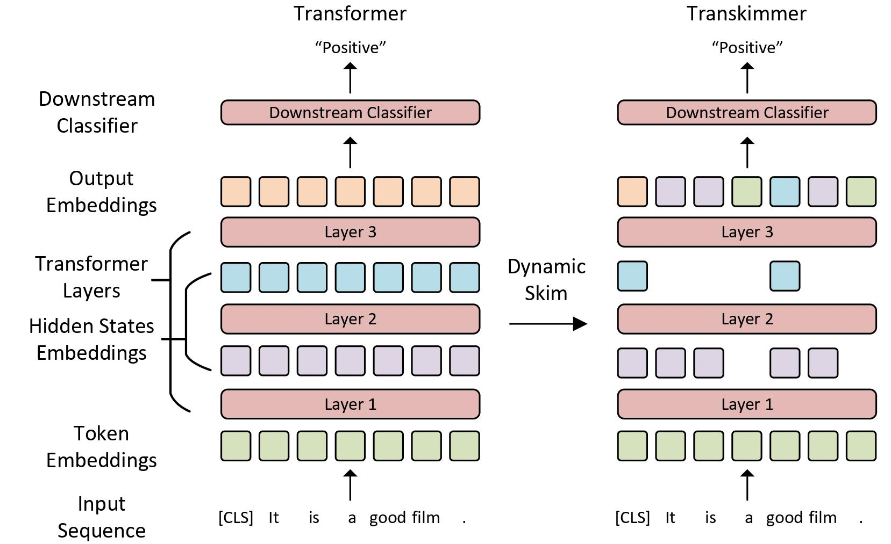

Transkimmer
===

## Introduction

This repo is the source code for ACL2022 publication *Transkimmer: Transformer Learns to Layer-wise Skim*.
Transkimmer is a input-dependent Transformer model compression method general applicable to a large set of variants.
The idea is to dynamically skim the input sequence with token granularity shown as following.



## How to use

This is a simple tutorial of how to use Transkimmer code base.

### Requirements

1. Install [Anaconda](https://www.anaconda.com/products/distribution) to management the virtual environment and libraries.
2. Install dependencies with Anaconda.

`conda create --name transkimmer --file requirements.txt `

3. Activate the created virtual environment.

`conda activate transkimmer`

### Datasets

1. GLUE and SQuAD

We use the [GLUE](https://huggingface.co/datasets/glue) and [SQuAD-v2](https://huggingface.co/datasets/squad_v2) provided by [datasets](https://huggingface.co/datasets) library. 
They are downloaded automatically, so there is nothing to be prepared.

2. 20News, Yelp, IMDB

We use these datasets of a preprocessed json format provided by [TR-BERT](https://github.com/thunlp/TR-BERT#classfication) repo.
Download and decompress these datasets.

### Finetuning

To finetune Transkimmer model on GLUE benchmarks, just run

`bash scripts/run_glue.sh`

The supported datasets is commented in each launching script.


## Citation

If you are interested in our work, please follow and cite it with
```
@inproceedings{guan-etal-2022-transkimmer,
    title = "Transkimmer: Transformer Learns to Layer-wise Skim",
    author = "Guan, Yue  and
      Li, Zhengyi  and
      Leng, Jingwen  and
      Lin, Zhouhan  and
      Guo, Minyi",
    booktitle = "Proceedings of the 60th Annual Meeting of the Association for Computational Linguistics (Volume 1: Long Papers)",
    month = may,
    year = "2022",
    address = "Dublin, Ireland",
    publisher = "Association for Computational Linguistics",
    url = "https://aclanthology.org/2022.acl-long.502",
    doi = "10.18653/v1/2022.acl-long.502",
    pages = "7275--7286",
    abstract = "Transformer architecture has become the de-facto model for many machine learning tasks from natural language processing and computer vision. As such, improving its computational efficiency becomes paramount. One of the major computational inefficiency of Transformer based models is that they spend the identical amount of computation throughout all layers. Prior works have proposed to augment the Transformer model with the capability of skimming tokens to improve its computational efficiency. However, they suffer from not having effectual and end-to-end optimization of the discrete skimming predictor. To address the above limitations, we propose the Transkimmer architecture, which learns to identify hidden state tokens that are not required by each layer. The skimmed tokens are then forwarded directly to the final output, thus reducing the computation of the successive layers. The key idea in Transkimmer is to add a parameterized predictor before each layer that learns to make the skimming decision. We also propose to adopt reparameterization trick and add skim loss for the end-to-end training of Transkimmer. Transkimmer achieves 10.97x average speedup on GLUE benchmark compared with vanilla BERT-base baseline with less than 1% accuracy degradation.",
}
```